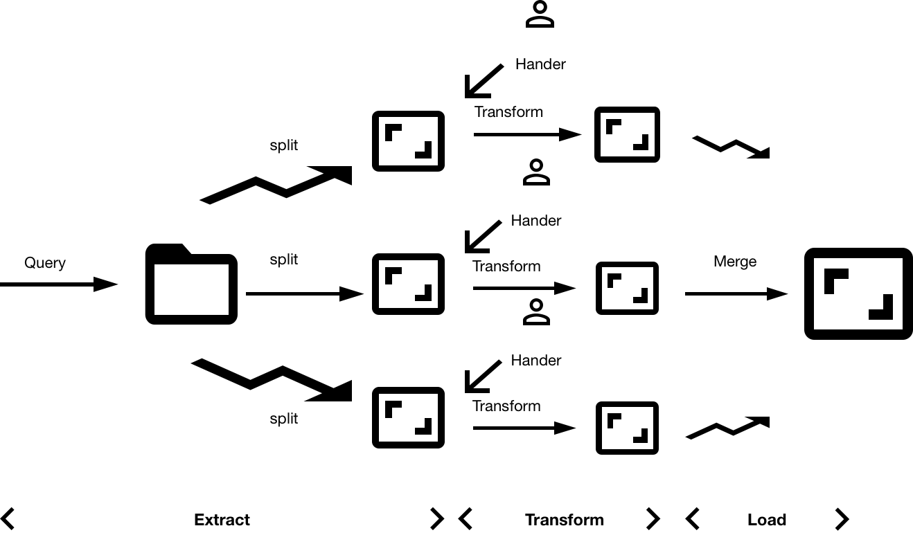

LightLane
====================

## Description

LightLane is an ETL framework including data dumper and data loader. As a result, it has realied data migration tasks.

- MySQL <--> Hive/Impala

From source to destination , the framework choose CSV file as transfer format.

```
MySQL     ----------- CSV  ----------- Hive/Impala
                      | |
```

## Workflow

### Data Dump

1. Extract

   Select data from database by execute sql.

2. Transform

   Deal with each row, including extracting data from json and flatten each row into rows.

3. Load

   Write data into CSV format.




### Data Load

MySQL, Hive can load data from CSV file：

- MySQL: `LOAD DATA INFILE 'data.txt' INTO TABLE table2 TERMINATED BY ','`
- Hive: `LOAD DATA LOCAL INPATH 'data.txt' OVERWRITE INTO TABLE table2`


